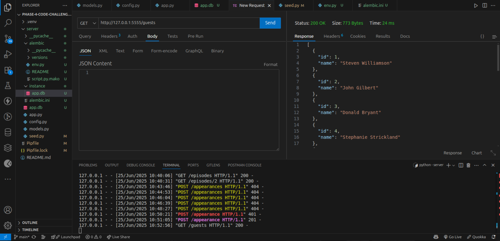

# Late Show API

A **Flask REST API** 
for managing Late Show Episodes, Guests, and Appearances.

## Setup

1. Clone the repository at:

   ```bash
 https://github.com/Cristinakamuthu/Phase-4-Code-Challenge-Two-Late-Show-API
   Then, cd late-show-api
   ```
2. Install dependencies:

   ```bash
   pipenv install
   pipenv shell
   ```

## Environment Variables

Create a `.env` file:

```bash
FLASK_APP=app.py
FLASK_ENV=development
SECRET_KEY=super-secret-key
DATABASE_URL=sqlite:///app.db
```

## Dependencies

Install them with =pipenv "The dependency you want"

* flask
* flask-sqlalchemy
* flask-migrate
* flask-jwt-extended
* psycopg2-binary
* pipenv
* shell
* faker
* alembic
* flask-cors
* sqlalchemy
* serializer
* sqlalchemy-serializer
* flask-bcrypt
* flask-restful

## Database Migrations

```bash
alembic init alembic
alembic revision --autogenerate -m "create tables"
alembic upgrade head
```

## Seeding the Database

```bash
python seed.py
```

## Run the Server

```bash
python app.py
```

## Authentication Flow

* **Register:** `POST /register`
* **Login:** `POST /login` (returns a JWT token)

Use the returned `token` in requests:

```
Authorization: Bearer <your_jwt_token_here>
```

## Available Routes

* `GET /episodes`
* `GET /episodes/<id>`
* `GET /guests`
* `POST /appearances` *(Requires JWT Auth)*

## Postman Usage Guide

Import into Postman and test endpoints for Registration, Login, Viewing Episodes, Viewing Guests, and Creating Appearances.

## GitHub Repository

[https://github.com/Cristinakamuthu/Phase-4-Code-Challenge-Two-Late-Show-API](https://github.com/Cristinakamuthu/Phase-4-Code-Challenge-Two-Late-Show-API)

## Screenshots for routes being used 
   # RegisterUsers --- registering users via the route created !
   

   # Login.png -- logging in the user via the route created !
   

   # Episodes.png -- getting all the episodes via the routes !
   

  # EpisodesWithID.png --- getting an episode by id using the routes!
   

  # Guests.png --- getting all the guests 
   

  # Appearances.png --- attempting to post without authorization token!
   

   # AppearancesAfterBearerTokeninput.png ---posting ....(while authorized via token)
   .png)

   
